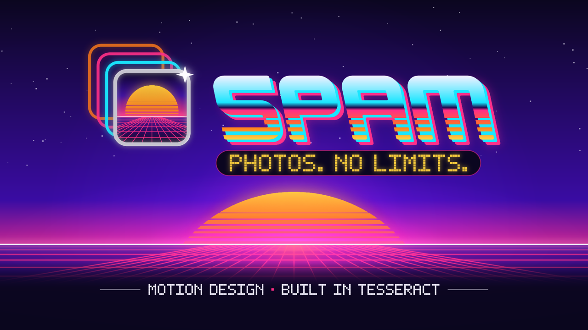

# Complex projects

Full productions — multi-scene edits, ads, music-driven sequences, imported footage, sound design. The kind of project you would actually ship, kept editable so you can see how the parts fit together.

Typical shape: multiple scenes, imported media, fifteen seconds or more.

| Project | Preview | What it shows |
| --- | --- | --- |
| **[Spam Showreel](spam-showreel/)** |  | A 15-second, seven-scene brand reel cut to music — 1,653 layers, beat-locked expressions, 3D camera moves, and not one imported image or font. |

To add one, read [AGENTS.md](../AGENTS.md).
