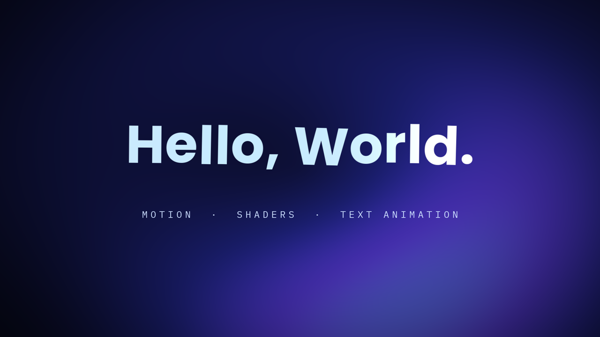

# Hello World

The smallest complete motion design piece worth shipping: an 8-second title card that animates the words *Hello, World.* onto a shader-generated background. It exists to show the three things Tesseract motion work is usually made of — **motion**, **shaders**, and **text animation** — in one project you can read end to end.

[](hello-world.mp4)

▶ **[hello-world.mp4](hello-world.mp4)** · 1920×1080 · 30 fps · 8 seconds

## What's in it

**Two custom WGSL shaders.** Neither is a stock effect; both are `customShader` effects authored in the project.

- `auroraField` paints the entire background. Three drifting sine fields sum into one scalar that is graded through indigo, violet, and teal, then shaped by an elliptical vignette so the centre of frame stays readable under type. It has no source image — the layer underneath is a flat rectangle, and every pixel you see is computed.
- `typeSweep` runs on the headline. It wipes the glyphs open left to right with a soft edge, grades them cool-to-warm across their width, and sends a narrow specular band travelling across them on a slow loop. It reads the layer's own alpha, so it follows the letterforms exactly and stays correct while the type is still moving.

Both shaders declare the reserved `animationTime` parameter, which the engine fills with the layer's clock every frame — so they animate with no keyframes and no animator attached.

**Motion.** The headline converges from wide tracking (260 → 10) while it rises, scales down from 104%, and fades up; the subtitle follows a second later and tightens into place. Everything eases with a single deliberate curve rather than a spring. At the end the tracking opens back out as the piece fades. The background's brightness is driven by a `jsScript` animator instead of keyframes — one pure function of time that does the fade-up, a slow breathing pulse, and the fade-out together.

**Text animation.** The headline carries a text animator with a wiggly selector. It varies each character's selection weight on its own clock, so every glyph drifts a few pixels vertically and rotates a degree or two independently of its neighbours. It is deliberately subtle — enough to keep the type alive during the hold, not enough to read as an effect.

## Files

| File | What it is |
| --- | --- |
| `hello-world.tsrct` | Editable Tesseract project. Both fonts are packaged inside; it renders identically anywhere. |
| `hello-world.mp4` | Rendered video, H.264, 1920×1080, 30 fps. |
| `preview.png` | Poster frame at 3.4s. |

Everything is live: the headline is real editable text, the shaders are readable WGSL with named parameters, and every keyframe is addressable.

## Remixing it

```text
Open hello-world.tsrct with Tesseract. Change the headline to "Ship it."
and retune auroraField from indigo to a warm amber and rose palette.
Keep the wipe and the per-character float as they are.
Render a filmstrip so I can check it, then export the MP4.
```

Other good first edits: raise `typeSweep`'s `sweepSpeed` to make the colour drift obvious, raise the wiggly selector's `amount` until the per-character float reads clearly, or drop a video layer underneath the headline and delete the background rectangle to turn the piece into an overlay.

## Credits and licensing

Built with [Tesseract](https://github.com/mirage-hq/Tesseract) 0.1.0, which is licensed under its own [terms](https://github.com/mirage-hq/Tesseract/blob/main/TERMS.md) and is not part of this repository.

This project — the composition, both WGSL shaders, the rendered video — is released under the repository's [MIT license](../../LICENSE). Use it however you like.

Two fonts are packaged inside the `.tsrct` and are **not** covered by that MIT license. Both are under the SIL Open Font License 1.1, which permits redistribution; full texts are in **[licenses/](licenses/)**:

| Font | Used for | Copyright |
| --- | --- | --- |
| Poppins Bold | Headline | Copyright 2020 The Poppins Project Authors |
| IBM Plex Mono Regular | Subtitle | Copyright © 2017 IBM Corp., Reserved Font Name "Plex" |

See [NOTICE.md](../../NOTICE.md) for how licensing works across this repository.
